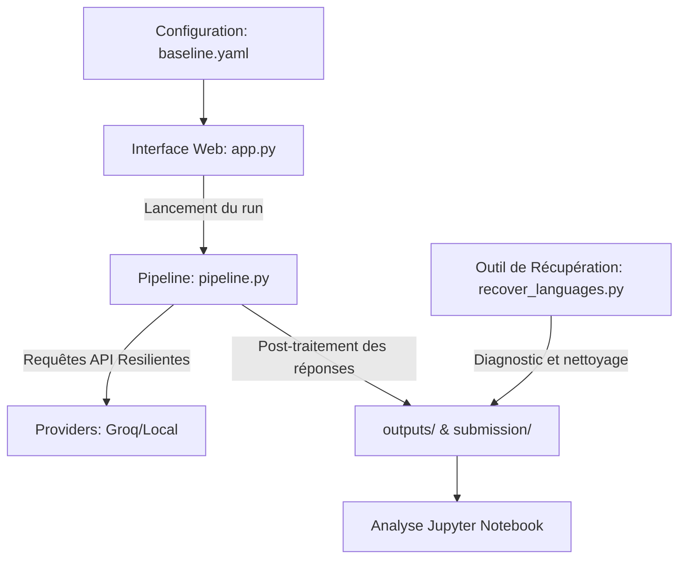

# ELOQUENT LLM Evaluation — Robustesse & Diversité Culturelle

Ce dépôt contient la plateforme d'évaluation et le pipeline d'exécution conçus pour le projet **ELOQUENT (CLEF 2026)**. Notre objectif est de tester, mesurer et analyser la sensibilité, la robustesse et la diversité culturelle des modèles de langage (LLMs) à travers 22 langues disponibles sur la plateforme ELOQUENT, en s'appuyant sur des API cloud (Groq) et des modèles exécutés localement (Ollama).

---

##  Contexte & Attentes du Projet ELOQUENT

Le projet **ELOQUENT** s'inscrit dans le cadre de la campagne d'évaluation CLEF 2026. Il vise à évaluer la capacité des grands modèles de langage à appréhender et respecter les nuances culturelles et géographiques.

### 1. Axes d'Évaluation Principaux
*   **Robustesse Culturelle (Jeux de données `specific`) :** Vérifier que le modèle reste stable, cohérent et fidèle à un contexte géographique ou culturel lorsqu'il est explicitement imposé dans la question, quelle que soit la langue de formulation.
*   **Diversité Culturelle (Jeux de données `unspecific`) :** Évaluer si le modèle adapte de manière fluide et pertinente ses réponses en fonction de la culture implicitement associée à la langue utilisée dans la question (ex. refléter les coutumes françaises en français, russes en russe).

### 2. Contraintes de Génération Techniques
Pour être acceptées sur la plateforme d'évaluation ELOQUENT, les réponses doivent respecter scrupuleusement les critères suivants :
*   **Format d'une phrase unique :** Le modèle doit répondre en **exactement une seule phrase**. Un post-traitement rigoureux est nécessaire pour nettoyer et tronquer les réponses trop longues ou contenant du raisonnement intermédiaire (Chain-of-Thought).
*   **Taille de sortie :** La longueur maximale est limitée à `max_new_tokens = 200` (environ une phrase).
*   **Déterminisme (Baseline) :** Pour la variante baseline, l'échantillonnage doit être désactivé (`do_sample = False` / `temperature = 0`).

### 3. Spécifications du Package de Soumission
Chaque exécution génère un dossier d'expérience contenant :
*   Des fichiers `.jsonl` nommés selon le format `{langue}_{dataset_type}.jsonl` (ex: `fr_specific.jsonl`). Chaque ligne doit être un objet JSON valide contenant exactement trois champs :
    ```json
    {
      "id": "question_id_xyz",
      "prompt": "Question originale...",
      "answer": "Réponse en une seule phrase propre."
    }
    ```
*   Un fichier de métadonnées obligatoire `submission_metadata.json` décrivant l'équipe, le système, le modèle utilisé, la date et les détails de l'ingénierie de prompt appliquée :
    ```json
    {
        "team": "Master MIAGE Toulouse",
        "system": "eloquent-miage-v1",
        "model": "llama-3.1-8b-instant",
        "submissionid": "experiment-20260607_190000",
        "date": "2026-06-07",
        "label": "eloquent-2026-cultural",
        "languages": ["fr", "en", "es", "de", "ru"],
        "modifications": {
            "system_prompt": "You are a culturally aware assistant...",
            "prompt_prefix_english": "...",
            "prompt_suffix_english": "...",
            "generation_params": {
                "do_sample": false,
                "max_new_tokens": 200,
                "max_questions": 0
            },
            "notes": "Variante 'system_constrained' | dataset 'specific'"
        }
    }
    ```

---

## Fonctionnalités de l'Application

L'application est structurée en plusieurs modules complémentaires pour automatiser le cycle complet : de la génération des réponses à leur analyse finale.



### 1. Interface Web Interactive (`app.py`)
Développée avec **Streamlit**, elle offre une console visuelle complète pour :
*   **Configurer le Run :** Sélectionner le provider (`groq` ou `local`), spécifier le modèle, choisir le type de jeu de données (`specific` ou `unspecific`), et définir les hyperparamètres (température, délai entre requêtes, limite de questions).
*   **Sélectionner les Langues :** Détection automatique des fichiers de données d'entrée disponibles dans le dossier `data/`.
*   **Choisir les Variantes de Prompt :** Basculer facilement entre les 4 approches d'ingénierie de prompt configurées.
*   **Suivre la Progression en Temps Réel :** Affichage d'une console de logs dynamique alimentée par un thread d'exécution séparé.
*   **Contrôler l'Exécution :** Possibilité d'arrêter proprement l'exécution en cours (via des signaux de thread) ou de la reprendre là où elle s'était arrêtée (`resume=True`).
*   **Exporter les Résultats :** Visualisation immédiate des réponses générées par langue, détection des réponses vides/simulées et téléchargement d'un package ZIP contenant les livrables au format requis.

### 2. Pipeline d'Exécution Robuste & Résilient (`pipeline.py`)
Le pipeline gère l'exécution multithreadée du traitement par langue avec plusieurs sécurités pour contrer les instabilités des APIs de production :
*   **Rotation de Clés API (Pool de Clés) :** Pour contourner les quotas stricts et les limitations de requêtes par minute (RPM) de Groq, le pipeline distribue dynamiquement les requêtes de chaque langue sur un pool de clés configuré en *Round-Robin*.
*   **Gestion Avancée des Erreurs API :**
    *   **Erreurs 429 (Rate Limit) :** Analyse le message de retour de l'API pour extraire la valeur recommandée `Retry-After` et met en pause le thread concerné avant de réessayer de manière illimitée (sans gaspiller de tentative standard).
    *   **Timeouts :** Implémente un timeout robuste (120s par défaut, 180s pour les modèles lents comme `llama-prompt-guard` sur les langues non-anglophones) avec des retries progressifs (progressive backoff : 10s, 20s, 30s...).
    *   **Circuit Breaker :** Arrête automatiquement le traitement d'une langue si 10 erreurs consécutives surviennent, évitant ainsi de saturer inutilees clés API en cas de panne globale.
*   **Post-Traitement Sémantique :** La fonction `clean_answer` élimine automatiquement les phrases de préambule et le raisonnement des modèles (Chain-of-Thought) pour ne conserver que la phrase finale demandée par la spécification.
*   **Mécanisme de Reprise :** Si une exécution est interrompue, le pipeline recharge le fichier de travail partiel et ignore les questions ayant déjà obtenu une réponse valide.

### 3. Ingénierie de Prompt & Variantes (`prompter.py`)
Quatre stratégies de prompting sont configurées dans [config/baseline.yaml](file:///c:/Users/Pixel/Documents/M2/Projet%20CLEF%202026/eloquent-llm-evaluation/config/baseline.yaml) pour étudier leur impact sur la sensibilité culturelle :
1.  **`baseline` :** Envoi de la question brute, sans consigne système ni mise en contexte.
2.  **`system_constrained` :** Ajout d'une consigne système imposant au modèle d'agir en tant qu'assistant sensible à la culture locale et de répondre succinctement selon les normes locales.
3.  **`cot_cultural` :** Utilisation d'une consigne de raisonnement forcé (*Chain-of-Thought*) demandant d'abord de soupeser le contexte culturel propre à la langue avant de formuler la réponse en une phrase.
4.  **`rewritten_query` :** Formulation demandant au modèle de reformuler lui-même la question afin d'en supprimer toute ambiguïté culturelle avant d'y répondre.

### 4. Utilitaire de Récupération des Langues (`recover_languages.py`)
Ce script utilitaire en ligne de commande permet de gérer la maintenance des données :
*   `python recover_languages.py --report` : Analyse le dossier `outputs/` et compare le nombre de réponses valides générées avec les entrées attendues des datasets d'origine dans `data/`. Affiche un rapport tabulaire indiquant le pourcentage de complétion de chaque langue.
*   `python recover_languages.py --clean-incomplete` : Supprime proprement les fichiers temporaires incomplets des langues n'ayant pas atteint 100% afin de pouvoir les relancer proprement en profitant des dernières optimisations du pipeline.

### 5. Analyse Quantitative & Qualitative (`Analyse_résultats_eloquent.ipynb`)
Le notebook Jupyter sert à l'analyse et à la validation scientifique des résultats générés :
*   **Statistiques Descriptives :** Distribution de la longueur des mots et des tokens des réponses par langue et par variante. Mesure des taux de réussite et de pannes.
*   **Analyse Sémantique via Embeddings :** Calcul de la similarité cosinus inter-langues en utilisant des embeddings de phrases de pointe (BERT de *SentenceTransformers* et *Word2Vec*) pour quantifier précisément la cohérence des réponses.
*   **Clustering & Visualisation (t-SNE) :** Regroupement sémantique par *K-Means* et projection 2D des réponses pour observer statistiquement si les modèles se regroupent par langue ou par stratégie de prompt.
*   **Typologie des Écarts Culturels :** Identification et catégorisation qualitative des faiblesses sémantiques des modèles (stéréotypes culturels, hallucinations géographiques, mauvaise interprétation linguistique, non-respect de la consigne syntaxique d'une seule phrase).

---

## Architecture des Fichiers du Projet

Voici l'organisation générale des répertoires et des scripts clés du workspace :

*   [app.py](file:///c:/Users/Pixel/Documents/M2/Projet%20CLEF%202026/eloquent-llm-evaluation/app.py) : Point d'entrée de l'interface graphique Streamlit.
*   [pipeline.py](file:///c:/Users/Pixel/Documents/M2/Projet%20CLEF%202026/eloquent-llm-evaluation/pipeline.py) : Moteur d'exécution asynchrone / multi-threadé du pipeline d'évaluation.
*   [prompter.py](file:///c:/Users/Pixel/Documents/M2/Projet%20CLEF%202026/eloquent-llm-evaluation/prompter.py) : Classe de gestion de l'application des templates et des consignes systèmes.
*   [recover_languages.py](file:///c:/Users/Pixel/Documents/M2/Projet%20CLEF%202026/eloquent-llm-evaluation/recover_languages.py) : Utilitaire CLI de suivi et de nettoyage des exécutions partielles.
*   [Analyse_résultats_eloquent.ipynb](file:///c:/Users/Pixel/Documents/M2/Projet%20CLEF%202026/eloquent-llm-evaluation/Analyse_r%C3%A9sultats_eloquent.ipynb) : Notebook Jupyter pour l'analyse scientifique et la visualisation.
*   **`config/`** :
    *   [config/baseline.yaml](file:///c:/Users/Pixel/Documents/M2/Projet%20CLEF%202026/eloquent-llm-evaluation/config/baseline.yaml) : Fichier de configuration de référence de l'évaluation (modèles, langues, paramètres de génération, templates).
*   **`providers/`** : Contient les connecteurs d'accès aux modèles.
    *   [providers/base.py](file:///c:/Users/Pixel/Documents/M2/Projet%20CLEF%202026/eloquent-llm-evaluation/providers/base.py) : Classe abstraite d'interface.
    *   [providers/api_provider.py](file:///c:/Users/Pixel/Documents/M2/Projet%20CLEF%202026/eloquent-llm-evaluation/providers/api_provider.py) : Client API Groq (gestion des clés en pool, retries et backoffs).
    *   [providers/local_provider.py](file:///c:/Users/Pixel/Documents/M2/Projet%20CLEF%202026/eloquent-llm-evaluation/providers/local_provider.py) : Connecteur d'API locale (Ollama / `http://localhost:11434/api/chat`).
*   **`data/`** : Répertoire contenant les jeux de données sources. Les sous-dossiers sont classés par type de tâche (`specific` / `unspecific`) et par variantes (`baseline`, `cot_cultural`, `system_constrained`, `rewritten_query`), contenant des fichiers JSONL comme `fr_specific.jsonl` ou `de_unspecific.jsonl`.
*   **`outputs/`** : Fichiers de travail temporaires contenant les logs de génération individuels bruts par modèle et par variante.
*   **`submission/`** : Packages de soumissions structurés par run/timestamp contenant les JSONL de soumission filtrés (champs `id`, `prompt`, `answer` uniquement) et le fichier de métadonnées requis.
*   [requirements.txt](file:///c:/Users/Pixel/Documents/M2/Projet%20CLEF%202026/eloquent-llm-evaluation/requirements.txt) : Dépendances logicielles du projet.
*   [FIX_SUMMARY.md](file:///c:/Users/Pixel/Documents/M2/Projet%20CLEF%202026/eloquent-llm-evaluation/FIX_SUMMARY.md) : Rapport technique détaillé sur la résolution des problèmes de timeouts API et l'optimisation des performances sur les langues non-anglophones.

---

## Guide de Démarrage Rapide

### 1. Installation des Dépendances
Assurez-vous de disposer de Python 3.10 ou supérieur, puis installez les bibliothèques requises :
```bash
pip install -r requirements.txt
```

### 2. Variables d'Environnement
Créez un fichier `.env` à la racine du projet et configurez vos clés API Groq. Vous pouvez en définir jusqu'à 5 pour activer la rotation automatique et maximiser votre quota :
```ini
GROQ_API_KEY=gsk_your_primary_key_here
GROQ_API_KEY2=gsk_second_key_here
GROQ_API_KEY3=gsk_third_key_here
GROQ_API_KEY4=gsk_fourth_key_here
GROQ_API_KEY5=gsk_fifth_key_here
```

### 3. Lancement de l'Application Web
Pour lancer la console interactive graphique, exécutez la commande suivante :
```bash
streamlit run app.py
```
Ouvrez l'URL locale indiquée (généralement `http://localhost:8501`) dans votre navigateur pour piloter vos runs.

### 4. Utilisation en Ligne de Commande (CLI)
Si vous préférez exécuter le pipeline directement depuis votre terminal sans interface graphique :
```bash
python pipeline.py --config config/baseline.yaml
```

> [!TIP]
> **Optimisation des Performances :** Si vous utilisez le modèle `meta-llama/llama-prompt-guard-2-86m`, notez que ses temps de réponse sur les langues non-anglophones (comme le russe ou le français) peuvent être très élevés. Le code réduit automatiquement sa taille de génération à 50 tokens max pour ces langues afin d'accélérer l'exécution sans altérer la détection.

---

## Maintenance & Suivi des Erreurs

En cas d'interruption réseau ou de saturation API (Rate Limits prolongés) :

1.  **Consulter le rapport d'état :**
    ```bash
    python recover_languages.py --report
    ```
2.  **Nettoyer les langues bloquées / incomplètes :**
    ```bash
    python recover_languages.py --clean-incomplete
    ```
3.  **Relancer le run :** Assurez-vous que l'option **"Reprendre le run existant (reprise)"** (dans la barre latérale Streamlit) ou le paramètre `resume: true` (dans le fichier YAML) est actif pour que le pipeline réutilise les réponses valides précédemment stockées dans `outputs/` et ne traite que les lignes manquantes.
